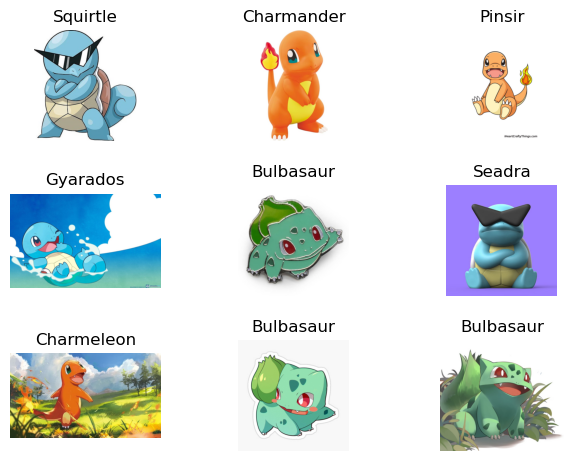

### Original Pokemon Classifier
A residual convolutional network for classifying most of the first 151 pokemon based on the [Deep Residual Learning for Image Recognition paper](https://arxiv.org/abs/1512.03385) and trained on the [dataset](https://www.kaggle.com/datasets/lantian773030/pokemonclassification) aggregated by [Lance Zhang](https://www.kaggle.com/lantian773030).

Training on a set of roughly 7000 images, I was able to train a 34 layer residual convolutional neural network to correctly estimate the Pokemon in the validation set at rate of 70%.

### Using the model
Three files are required in order to use the model:
1. predict.py
2. poke_classifier_params
3. model.py

The files require the dependencies:
- torch
- torchvision.io

Place all three files in the same folder then run `python predict.py` in a shell. You will be prompted for the filepath to an image which the model will then attempt to classify.
